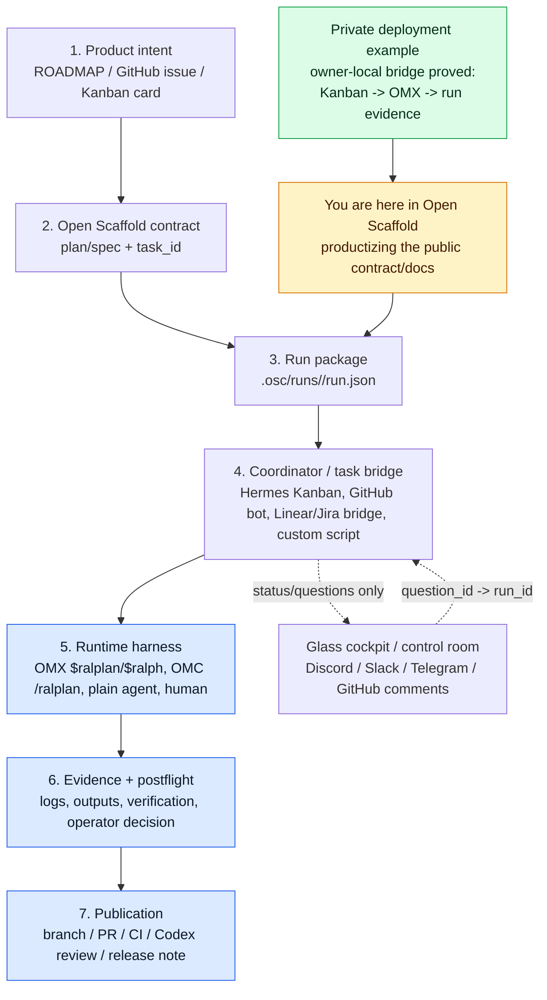

# Runtime Harness Dispatch Pattern

> Status: adapter-boundary guidance. `$work` can now launch a bounded runtime adapter only when explicit backend authority is passed. Open Scaffold records the work package, gates, receipts, logs, and evidence; humans keep owner authority.

Open Scaffold defines the portable contract for semi-autonomous work. A runtime adapter consumes `.osc/runs/<run_id>/run.json`, executes the selected bounded package when allowed, and writes a repo-relative receipt back under the same run directory.

This page captures a **private deployment example**: an owner-local Command Center used Hermes Kanban -> OMX `$ralplan` to prove the dispatch shape. It translates that private dogfood pattern into the public Open Scaffold model; the private deployment is not required to adopt Open Scaffold. The detailed adapter/binding responsibilities live in [`docs/RUNTIME_BINDING_CONTRACT.md`](RUNTIME_BINDING_CONTRACT.md), trust/safety boundaries live in [`docs/TRUST_BOUNDARIES.md`](TRUST_BOUNDARIES.md), and reference labels live in [`docs/REFERENCE_TRUTH.md`](REFERENCE_TRUTH.md).

## Executive rule

```text
Open Scaffold packages.
A runtime adapter executes only after explicit backend authority.
A task bridge — external work queue/status board — may coordinate.
A harness — workflow wrapper around an agent — does bounded work.
An operator surface — chat/dashboard for humans — observes and answers gates.
GitHub publishes after owner gates.
Evidence records what happened; it does not approve the result.
```

## Where we are right now



Current state:

- `$work` writes a controlled work package and a runtime receipt for every executable run.
- Without `--allow-spawn`, `$work` stops at a dry-run receipt and no adapter process starts or project-local adapter config is resolved.
- With `--allow-spawn`, `$work` can launch the selected runtime adapter, parse its final marker, write bounded/redacted logs, and update status/gates.
- The built-in Codex adapter path is provider-neutral at the contract level: it is one adapter implementation, not a hard dependency on Codex internals.
- A **private deployment example** proved Hermes Kanban dispatching a task into detached OMX `$ralplan` and preserving run evidence; it is dogfood evidence, not an adoption requirement.
- Open Scaffold already has the generic `task_id` / `run_id` / `operator_surface` schema.
- Later adapter/product work can add more coordinators and richer control-room transport without changing the core owner boundary.

## Layer ownership

| Layer | Owns | Examples | Must not own |
|---|---|---|---|
| Open Scaffold core | repo-native contract, `run.json` work package (run packet), evidence locations, task/run identity | `.osc/plans`, `.osc/runs`, `osc run`, docs, PR templates | live task lifecycle, runtime auth, agent spawning |
| Task bridge / coordinator | operational state and dispatch decision | Hermes Kanban, GitHub Issues bot, Linear/Jira bridge, local queue | final evidence or runtime internals |
| Runtime harness | actual planning/build/review loop while alive | OMX, OMC, Claude Code, Codex CLI, human lane | canonical task database or commit authority |
| Operator surface — chat/dashboard for humans | visibility, questions, approvals | Discord, Slack, Telegram, GitHub comments, CLI dashboard | source of truth |
| GitHub/publication | versioned implementation and review | branch, PR, CI, Codex connector review, release | runtime session truth |

## Canonical public flow

```text
ROADMAP item / issue / task
  -> plan or spec in .osc/plans or .osc/specs
  -> osc run ... --task-id ... --executor ... --harness-skill ...
  -> .osc/runs/<run_id>/run.json
  -> coordinator/adapter validates packageQuality.executable
  -> selected harness executes in isolated session/worktree
  -> artifacts/logs/outputs promoted back to .osc/runs and/or PR
  -> postflight verifies against acceptance criteria
  -> operator approval gates merge/release
```

## What Open Scaffold core should generate

Open Scaffold should generate or preserve enough information for an adapter to act without guessing:

```json
{
  "taskId": "issue:42",
  "runId": "20260512T090000Z-m5-runtime-harness-bindings",
  "executor": {
    "lane": "omx-codex",
    "harnessSkill": "$ralplan",
    "spawning": false
  },
  "runtime": {
    "repoPath": "/absolute/path/to/repo",
    "worktreePath": null,
    "branch": "feat/runtime-harness-bindings"
  },
  "bindings": {
    "operatorSurface": "discord",
    "operatorThreadId": null,
    "githubIssue": "42",
    "githubPr": null
  },
  "packageQuality": {
    "executable": true,
    "blockers": [],
    "requiredAction": null
  },
  "commitPolicy": "no commit/push unless explicitly approved by the operator"
}
```

`spawning: false` means the package has not been granted backend launch authority yet. `$work --allow-spawn` records explicit authority before launching a runtime adapter, and the adapter receipt becomes the evidence of that launch.

## What the coordinator/adapter should do

A coordinator or runtime-specific binding should follow the contract in [`docs/RUNTIME_BINDING_CONTRACT.md`](RUNTIME_BINDING_CONTRACT.md):

1. Read `.osc/runs/<run_id>/run.json`.
2. Refuse dispatch unless `packageQuality.executable` is true.
3. Validate executor lane and harness skill — runtime command/mode.
4. Create an isolated runtime session or worktree when needed.
5. Launch the selected harness with the generated prompt/artifact bundle.
6. Attach runtime bindings back to the run record:
   - tmux session
   - process id
   - worktree
   - branch
   - log paths
   - operator thread/comment id
7. Route blocking questions by `question_id -> run_id`, never by latest chat message.
8. Promote final artifacts, status, logs, and verification evidence back into `.osc/runs`, GitHub PRs, or release notes.
9. Leave commit/push/merge gated by the operator unless the package explicitly grants that authority.

## OMX example

A coordinator can turn this Open Scaffold command:

```bash
npm run osc -- run .osc/plans/active/001-runtime-harness-bindings.md \
  --task-id issue:42 \
  --executor omx-codex \
  --harness-skill '$ralplan' \
  --operator-surface discord \
  --repo /path/to/repo
```

into a bounded OMX launch such as:

```text
$ralplan "Read .osc/runs/<run_id>/package.md. Plan only. Do not implement, commit, push, deploy, or publish. If blocked, emit BLOCKED with a question_id. If ready, emit READY_FOR_POSTFLIGHT and cite evidence paths."
```

The exact launch mechanics for a richer coordinator — tmux, Codex auth refresh, update prompts, hooks, watchdogs, and long-lived session logs — belong in an OMX binding or coordinator. The `$work` adapter path here stays bounded: one process, one run package, strict markers, bounded logs, and a repo receipt.

## Anti-patterns

Avoid:

- putting private deployment state, Hermes Kanban state, Discord bot state, or owner-specific auth setup inside Open Scaffold core;
- making Discord the task database;
- letting OMX/OMC runtime state replace `.osc/runs` evidence;
- dispatching a harness from vague prose without a `run.json` work package (run packet);
- launching an adapter without explicit backend authority such as `--allow-spawn`;
- letting a chat reply answer a question without `question_id -> run_id` correlation;
- treating a dry-run `spawning: false` receipt as a failed feature instead of the default safety boundary.

## Product implication

Open Scaffold should productize the method, not any private cockpit. The public core should make every task/run/harness boundary clear enough that many coordinators can implement the launch layer:

```text
Open Scaffold core = WHAT/WHERE/PROOF
Coordinator/adapter = WHEN/WHO/LAUNCH
Harness = HOW TO EXECUTE
Operator surface = HUMAN CONTROL GLASS (chat/dashboard for status and approvals)
GitHub = PUBLIC VERSIONED REVIEW
```
